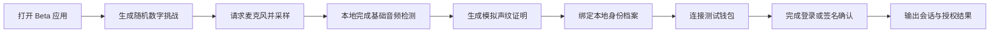

# VoiceID Beta 施工计划

版本：v0.1
日期：2026-07-03
目标：从官网公开态直接推进到可演示、可验收的 Beta 版

## 0. 2026-07-11 实施状态更新

Browser Beta v0.1 的本地实现已完成，入口为 `/beta/`。

已交付：

- ADR-001：固定注册短语、随机本地挑战和钱包动态 nonce 的安全分层。
- `VoiceID_Protocol_Schema.md`：核心对象、状态、错误码、存储与过期约束。
- `VoiceID_Beta_验收清单.md`：42 个功能、失败、隐私、可访问性和响应式场景。
- 随机 6 位数字挑战与 2 分钟过期控制。
- 浏览器麦克风采样、基础质量指标和音轨清理。
- 明确标记的演示音频路径与 `demo-only` VoiceProof。
- session-only IdentityProfile、PIN/恢复密钥格式演示。
- EIP-1193 注入钱包连接、可读测试签名消息和模拟钱包回退。
- `signed-demo` AuthSession，强制 `serverVerified=false`。
- 发布检查脚本对 Beta RPC、存储、网络调用和隐私红线的自动扫描。

仍需人工/后续完成：

- 在用户主动授权的真实设备上验收麦克风成功、拒绝、无设备和质量失败路径。
- 在安装注入钱包的浏览器中验收连接、拒绝、签名和账户/网络变化路径。
- GitHub Pages 发布后的公网路由复核。
- 生产声纹模型、模板 enrollment、活体检测、服务端 nonce 与 EOA/ERC-1271 验签。
- 英文 Beta 页面。

当前判定：Browser Beta 本地工程闭环已完成；真实麦克风、真实钱包与公网发布仍处于待人工验收状态。以下第 1 节保留 2026-07-03 的施工前基线，作为进度对照。

## 1. 整体进度评估

当前项目处于 P0 完成、P1 未完成的阶段。

已完成：

- 官网中文版与英文版已建立。
- GitHub Pages 静态发布路径已打通。
- VI 透明底 SVG 资产已归档。
- 项目基础 README、开发计划施工文档已建立。
- 本地预览端口已统一到 `3400`。
- 前一轮已清理旧 Playwright 截图输出和未引用 CSS。

未完成：

- 还没有 Beta 应用入口。
- 还没有声纹挑战、采样、验证或模拟验证流程。
- 还没有身份证明对象、授权范围、会话对象和错误码的落地数据结构。
- 还没有钱包连接、签名确认或恢复流程。
- 还没有开发者接口、示例调用和测试夹具。
- 还没有 CI、发布前检查脚本或 Beta 验收脚本。

判断：

- 官网完成度：高。
- 协议文档完成度：中低。
- Beta 产品完成度：低。
- 直达 Beta 的关键不在继续扩展官网，而在建立一个最小可用的身份验证闭环。

## 2. Beta 定义

Beta 版不是生产级生物识别系统，也不接触主网资金。Beta 版必须证明 VoiceID 的产品闭环可跑通：



Beta 必须包含：

- Beta 应用入口：`/beta/`。
- 声纹挑战：随机数字或短语挑战。
- 音频采样：使用浏览器麦克风权限，显示采样状态和波形反馈。
- 本地验证适配器：先实现模拟验证与基础音频质量检测，保留真实模型接口。
- 身份证明对象：包含挑战、时间戳、验证范围、钱包地址、过期时间和状态。
- 钱包连接：优先支持浏览器注入钱包的测试网络连接。
- 签名确认：使用测试消息签名，不发起真实资产转移。
- 回退路径：PIN 或恢复密钥的模拟流程。
- 开发者示例：展示 `connect`、`authenticate`、`verify` 的最小调用形态。
- 验收检查：语言、资源、路由、权限失败、钱包缺失、签名拒绝等路径可测。

Beta 明确不包含：

- 主网资产、支付、转账或托管。
- KYC 或实名身份认证。
- 生产级声纹模型与模型训练。
- 后端账户系统。
- 移动端原生钱包。
- 长期保存原始语音。

## 3. 技术路线

为了直奔 Beta，第一版继续沿用当前仓库的静态站点优势，不马上引入复杂构建链。

建议路线：

- 官网继续保持根目录静态页面。
- 新增 `beta/` 静态应用目录。
- 使用浏览器原生能力：Web Audio API、MediaDevices、localStorage、Clipboard、EIP-1193 钱包接口。
- 不默认引入后端服务，先以本地状态和模拟证明跑通流程。
- 所有本地预览端口限定在 `3400-3499`，默认使用 `3400`。
- 后续如确需框架，再在 Beta 验收后引入，而不是在第一步增加构建复杂度。

推荐首版目录：

```text
beta/
  index.html
  beta.css
  beta.js
  adapters/
    voice-proof.js
    wallet-provider.js
  fixtures/
    demo-identity.json
docs/
  VoiceID_Beta_施工计划.md
  VoiceID_Protocol_Schema.md
  VoiceID_Beta_验收清单.md
```

## 4. 施工节奏

### B0：Beta 范围冻结

周期：0.5 天

任务：

- 确认 Beta 只做测试网、模拟声纹证明和本地身份档案。
- 确认不做主网、不做 KYC、不保存原始语音。
- 建立 Beta 验收清单。

验收：

- Beta scope 写入文档。
- 风险边界写清楚。
- 用户能区分演示证明与生产生物识别。

### B1：协议数据结构落地

周期：1-2 天

任务：

- 编写 `VoiceID_Protocol_Schema.md`。
- 定义 `VoiceChallenge`、`VoiceProof`、`IdentityProfile`、`WalletBinding`、`AuthSession`。
- 定义授权范围：`login`、`wallet:sign`、`identity:read`、`recovery:test`。
- 定义错误码：麦克风拒绝、采样过短、钱包缺失、签名拒绝、会话过期。

验收：

- 每个对象都有字段、状态、示例 JSON。
- Beta 应用按同一结构读写数据。

### B2：Beta 应用壳

周期：2 天

任务：

- 新增 `/beta/` 页面。
- 建立三栏或三步流程：声纹挑战、身份档案、钱包确认。
- 沿用 VoiceID VI 和透明 SVG。
- 实现本地状态面板和错误提示。

验收：

- `/beta/` 可从官网进入。
- 桌面和移动端无横向溢出。
- 英文/中文内容不混杂；首版可先做中文版 Beta，英文 Beta 后续补齐。

### B3：声纹挑战与本地验证适配器

周期：2-3 天

任务：

- 生成随机数字挑战。
- 请求麦克风权限。
- 显示采样状态、音量、时长和基础质量结果。
- 生成模拟 `VoiceProof`。
- 保留真实模型接口：`createVoiceProof(challenge, audioFeatures, scope)`。

验收：

- 麦克风允许、拒绝、无设备三条路径都有反馈。
- 不把原始音频写入仓库或长期存储。
- 验证结果可驱动后续钱包步骤。

### B4：钱包连接与测试签名

周期：2-3 天

任务：

- 接入浏览器注入钱包接口。
- 获取测试网络地址。
- 生成测试签名消息。
- 将钱包地址绑定到 `IdentityProfile`。
- 输出 `AuthSession`。

验收：

- 无钱包、拒绝连接、拒绝签名、签名成功四条路径可跑。
- 不触发真实转账。
- 授权范围和过期时间清晰展示。

### B5：开发者示例与文档

周期：1-2 天

任务：

- 在官网开发者区更新 Beta 示例。
- 新增最小 SDK 形态文档。
- 提供示例 JSON 和伪代码。

验收：

- 第三方能看懂如何接入 VoiceID Beta。
- 示例和 Beta 应用使用同一套数据结构命名。

### B6：验收、发布与冻结

周期：1-2 天

任务：

- 建立发布前检查脚本。
- 验证 `/`、`/en/`、`/beta/`。
- 检查端口只使用 `3400-3499`。
- 检查资源缺失、语言混杂、横向溢出。
- 打 tag 或建立 Beta 发布说明。

验收：

- GitHub Pages 能访问 Beta。
- Beta 验收清单全通过。
- 已知限制写入 release note。

## 5. 直奔 Beta 的优先级

P0 必做：

- `docs/VoiceID_Protocol_Schema.md`
- `docs/VoiceID_Beta_验收清单.md`
- `/beta/` 应用入口
- 本地声纹挑战与模拟证明
- 测试钱包连接与签名确认

P1 可延后：

- 英文版 Beta 页面。
- 复杂 SDK 封装。
- 多链真实适配。
- 后端服务。
- 自动化浏览器截图报告。

P2 暂不做：

- 主网交易。
- 真实 KYC。
- 生产级声纹模型。
- 移动原生应用。

## 6. Beta 验收标准

功能验收：

- 用户能进入 `/beta/`。
- 用户能完成一次声纹挑战模拟验证。
- 用户能连接测试钱包。
- 用户能签名测试消息。
- 页面能生成可读的身份会话结果。
- 用户能通过 PIN 或恢复密钥路径看到回退流程。

安全与隐私验收：

- 不保存原始音频。
- 不发起真实转账。
- 所有证明对象有过期时间。
- 所有钱包操作前都有明确确认。
- 失败路径不会卡死。

工程验收：

- 本地预览端口只使用 `3400-3499`。
- 静态资源无缺失。
- 英文页面无中文混入。
- GitHub Pages 发布后可访问。
- 文档、示例、页面术语一致。

## 7. 两周冲刺安排

| 天数 | 目标 | 交付 |
| --- | --- | --- |
| D1 | 冻结 Beta 范围和数据结构 | Schema 文档、验收清单 |
| D2-D3 | 建立 `/beta/` 应用壳 | Beta 页面、基础状态流 |
| D4-D5 | 声纹挑战和模拟证明 | 麦克风采样、VoiceProof |
| D6-D7 | 钱包连接和测试签名 | WalletBinding、AuthSession |
| D8 | 回退路径和错误态 | PIN、恢复密钥、失败路径 |
| D9 | 官网与开发者文档联动 | 入口、示例、说明 |
| D10 | 验收、修复、发布 | Pages Beta、发布说明 |

## 8. 当前立即执行顺序

1. 写 `VoiceID_Protocol_Schema.md`。
2. 写 `VoiceID_Beta_验收清单.md`。
3. 新增 `/beta/` 静态应用入口。
4. 实现声纹挑战与模拟证明。
5. 接入浏览器钱包测试签名。
6. 更新官网 CTA 指向 Beta。
7. 发布 GitHub Pages Beta。

结论：不要再把主要精力放在官网美化上。官网已经足够承担入口职责；下一阶段必须把 VoiceID 做成一个能跑通声纹挑战、身份证明、钱包绑定和签名确认的 Beta 闭环。
