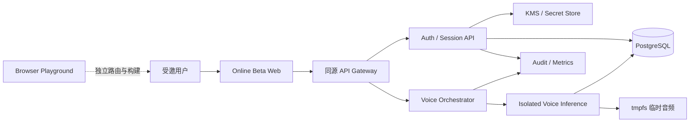

# VoiceID Online Beta v0.2 就绪度审计与施工计划

状态：Approved / Sprint 0 实施中
日期：2026-07-21
适用范围：从 Browser Beta v0.1 本地演示升级到邀请制、真实可用的 Online Beta
前置文档：[`ADR-001_Beta_挑战与签名分层.md`](ADR-001_Beta_挑战与签名分层.md)、[`VoiceID_Protocol_Schema.md`](VoiceID_Protocol_Schema.md)、[`VoiceID_Beta_验收清单.md`](VoiceID_Beta_验收清单.md)

## 0. 执行结论

当前仓库已经完成一个表达诚实、边界清楚的 Browser Playground，但不是线上认证系统。

它能证明：

- 浏览器麦克风授权、音频质量检测和释放流程可运行。
- EIP-1193 钱包连接与可读签名请求可运行。
- `demo-only` VoiceProof、session-only 档案和 `serverVerified=false` 会话可演示。
- 官网、文档、品牌资产和静态发布检查具备继续演进的基础。

它不能证明：

- 用户念对了随机数字。
- 当前声音属于已注册用户。
- 音频不是录音回放、合成语音或虚拟音频注入。
- 钱包签名有效、nonce 未重放、会话由可信服务器签发。
- 声纹数据处理已经满足隐私、合规、删除和安全要求。

因此，最快的可信路线分为三个发布单元：

| 发布单元 | 目标时间 | 对外承诺 | 声音角色 | 认证结果 |
|---|---:|---|---|---|
| A. Browser Playground v0.1 | 1-2 天 | 公网可体验协议编排 | 本地音频质量演示 | 不认证，`serverVerified=false` |
| B. Online Beta v0.2 | 4-6 周 | 邀请用户可真实注册、登录、退出、撤销 | 实验性附加信号 | Passkey 或服务端 SIWE 验证后签发会话 |
| C. Verified Voice Pilot | 6-10+ 周 | 受控设备/人群的声纹辅助验证试点 | 短语匹配 + 说话人匹配 + PAD 风险信号 | 仍不能作为唯一认证因子 |

建议立刻推进 A 与 B；C 必须通过模型评估、隐私影响评估和独立安全审查后才能开放。

## 1. 当前就绪度

| 领域 | 当前状态 | 上线差距 | 判定 |
|---|---|---|---|
| 官网与品牌 | 中英文静态站、SVG、白皮书已存在 | 公网尚未发布本地新成果；能力文案超前 | 可复用，先校正文案 |
| Browser Beta | 本地主流程完整、静态检查通过 | 只有音质检测，无语音/说话人识别 | Playground 可发布 |
| 协议 | v0.1 Schema/ADR/42 项验收清单 | 只描述本地演示，禁止网络请求 | 新建 v0.2 契约 |
| 钱包认证 | 客户端 `personal_sign` 返回 | 无服务器 nonce、EOA/ERC-1271 验签和消费 | P0 阻塞 |
| Passkey | 无 | 无普通用户强认证与安全恢复 | P0 阻塞 |
| 声纹引擎 | 无真实模型 | 无 enrollment、短语匹配、说话人验证、PAD | P0 研究门槛 |
| 会话 | 客户端生成并存 `sessionStorage` | 无 HttpOnly 会话、撤销、轮换、超时 | P0 阻塞 |
| 数据层 | 无 | 无用户、凭证、同意、挑战、审计和删除 | P0 阻塞 |
| 隐私合规 | 白皮书有原则 | 无单独同意、影响评估、地区/未成年人边界 | P0 阻塞 |
| 工程发布 | 静态脚本通过 | 无自定义 CI、预览/预发环境、回滚与可观测性 | P0 阻塞 |
| 安全验证 | 静态禁用规则 | 无 ASVS、依赖扫描、渗透测试、威胁模型回归 | P0 阻塞 |

公网状态截至 2026-07-21：官网返回 200，`/beta/` 和 `/docs/` 返回 404；远端 `main` 仍只有 3 次历史提交。

## 2. Online Beta 的产品定义

### 2.1 必须实现

- 邀请制注册，限定地区、年龄与测试条款。
- Passkey 注册/登录；钱包用户可使用服务端验证的 SIWE 登录。
- 服务器签发、轮换、撤销和过期的 HttpOnly 会话。
- 服务器签发并单次消费的语音挑战与钱包 nonce。
- 真实随机短语/数字转写匹配，证明用户念出了当前挑战。
- 封闭人群中的实验性 speaker verification 与反回放评分。
- 明确的单独同意、撤回同意、删除账户和删除声纹模板流程。
- 审计事件、限速、错误追踪、健康检查、告警和回滚。
- 中文 Beta 主流程；英文官网只链接并标注语言状态，英文 Beta 可列为 P1。

### 2.2 明确不做

- 不发主网交易，不请求代币授权，不托管私钥/助记词。
- 不把声音用作唯一登录、唯一恢复或高价值操作批准因子。
- 不做 KYC、实名或“唯一人类/唯一声纹”凭证。
- 不做 DID Registry、Validator Network、ZK nullifier 或多链资产管理。
- 不向第三方 SDK 开放未经稳定验证的 `VoiceProof`。
- 不保留原始音频用于训练、研究或客服回放；研究用途必须另立数据集和另行同意。
- 不允许 Playground 的模拟音频、模拟钱包、演示 PIN 或演示恢复密钥进入生产路由。

### 2.3 对外承诺

Online Beta 的准确表述应是：

> VoiceID Online Beta 使用 Passkey 或经服务端验证的钱包签名建立真实会话，并在受控测试中评估随机语音挑战、短语匹配和说话人匹配。声音不是唯一认证因子，系统不处理资产交易。

在 Verified Voice Pilot 达标前，不使用“安全声纹登录”“声音就是唯一身份”“声纹守住钱包”等已完成能力表述。

## 3. 信任模型与关键决策

### 3.1 信任根

- 浏览器、DOM、`sessionStorage`、前端分数和客户端生成的会话全部视为不可信。
- 只有服务端消费过一次性挑战、验证 Passkey/SIWE、执行风控策略后，才能建立认证会话。
- Passkey 负责普通用户的强认证与恢复基线。
- SIWE 负责证明用户控制某个 EVM 地址，不证明该地址对应实名自然人。
- 声音只输出策略信号：采集质量、短语匹配、说话人相似度、PAD/回放风险；它不直接签发会话。

### 3.2 浏览器声纹的不可消除限制

通用浏览器无法可靠证明音频来自物理麦克风，也无法完全阻止虚拟音频设备、系统级注入或经过处理的合成语音。纯浏览器本地推理虽然更隐私，但服务端不能信任客户端返回的模型分数。

因此存在一个必须明确批准的取舍：

| 方案 | 隐私 | 服务端可信度 | 结论 |
|---|---|---|---|
| 仅浏览器本地推理 | 较好 | 客户端可伪造，不能用于服务端认证 | 只适合 Playground/UX |
| 服务端短暂处理音频 | 处理敏感个人信息，要求严格合规 | 可执行一致模型与策略 | 推荐用于邀请制实验 |
| 原生客户端 + 硬件/设备证明 | 潜力最好 | 工程和平台成本高 | 后续路线，不阻塞 v0.2 |

v0.2 推荐服务端短暂处理，但必须先完成单独同意、个人信息保护影响评估、数据区域决策、处理者清单和删除验证。

## 4. 目标架构



### 4.1 发布边界

- 官网和 Playground 可继续由 GitHub Pages 承载。
- Online Beta 使用独立子域或独立路径，并由支持自定义响应头、同源 API、预览环境和回滚的托管平台承载。
- WebAuthn RP ID、SIWE domain、Cookie domain 和实际 TLS origin 必须在施工前冻结。
- 推荐通过反向代理让 Web 与 API 同源，避免跨域 Cookie、CORS 和 origin 漂移。
- 语音推理服务不暴露公网，只接受内部身份认证后的短期请求。

### 4.2 建议技术栈

| 层 | 建议 | 理由 |
|---|---|---|
| Web | Vite + TypeScript；UI 可从现有原生页面迁移 | 构建小、类型明确、可保留现有 HTML/CSS |
| Auth API | Node.js LTS + Fastify + OpenAPI/JSON Schema | 与前端共享类型，适合小型认证 API |
| Passkey | 经过维护的 WebAuthn server/client 库 | 不手写 CBOR、COSE 或 ceremony 校验 |
| SIWE | 标准 SIWE parser/verifier + EOA/viem + ERC-1271 provider | 不手写消息解析和签名恢复 |
| 数据库 | PostgreSQL | 事务消费 nonce、凭证、会话、同意和审计足够 |
| Voice | Python + FastAPI + 独立模型运行时 | 方便模型评测、ONNX/PyTorch 推理与隔离 |
| 契约 | OpenAPI 3.1 + JSON Schema 为唯一真源 | 生成 TS/Python 类型和测试夹具，消除文档漂移 |
| 部署 | 容器化、三环境、基础设施即代码 | 保证可复现、可回滚和区域可选 |

不建议首版引入区块链合约、DID 节点、事件总线、微服务网格或复杂 SDK。除 Voice Inference 因运行时和敏感数据隔离而独立外，其余后端先保持一个模块化服务。

## 5. 认证与语音流程

### 5.1 Passkey

```text
POST /v1/webauthn/registration/options
  -> server stores challenge hash + expiry
  -> browser navigator.credentials.create()
POST /v1/webauthn/registration/verify
  -> server verifies origin, RP ID, challenge, UP/UV and attestation policy
  -> credential persisted

POST /v1/webauthn/authentication/options
  -> server stores single-use challenge
  -> browser navigator.credentials.get()
POST /v1/webauthn/authentication/verify
  -> server verifies assertion and counter/backup state policy
  -> session created
```

注册后鼓励添加第二个 Passkey 或绑定钱包；删除最后一个可用认证器必须二次确认。

### 5.2 SIWE

```text
POST /v1/siwe/challenge
  -> server creates ABNF-conformant message + single-use nonce + 5 min expiry
  -> wallet signs readable message
POST /v1/siwe/verify
  -> strict parse
  -> verify origin/domain/URI/chain/address/nonce/time
  -> EOA ERC-191 recovery or contract-wallet ERC-1271 verification
  -> consume nonce transactionally
  -> create server session
```

只允许明确的测试链白名单。账户或链变化使待签名挑战失效。登录 API 永不调用交易、授权或切链方法。

### 5.3 Voice enrollment

1. 用户先通过 Passkey 或 SIWE 建立已验证会话。
2. 页面展示单独同意、用途、保存内容、保留期、退出方式和失败替代路径。
3. 服务器签发 3-5 个短时、单次、不可预测的朗读挑战。
4. 每个样本先做音频质量、语音活动与挑战短语匹配。
5. 只对通过样本提取说话人 embedding；建立模板并记录模型/策略版本。
6. 原始音频只在加密通道和隔离推理内存/tmpfs 中存在，推理后立即删除。
7. 模板用每用户数据密钥加密；密钥由 KMS 包装，数据库不存明文 embedding。
8. 记录同意版本、模型版本、质量统计和删除期限，不记录可回放音频。

### 5.4 Voice verification

```text
server VoiceChallenge
  -> audio quality
  -> speech activity
  -> phrase / digit match
  -> speaker similarity
  -> replay / synthetic risk score
  -> policy decision
  -> VoiceAssessment (server-signed, short-lived, single-use)
```

`VoiceAssessment` 必须分别包含各阶段结果，不再用一个含糊的 `status=verified` 表示所有结论。首版只把它用于实验统计或附加风控；Passkey/SIWE 仍是会话成立的必要条件。

## 6. 数据模型与生命周期

### 6.1 最小表

- `users`：内部随机 ID、状态、地区、创建/删除时间。
- `auth_credentials`：Passkey public key/credential ID/counter/backup flags；不存私钥。
- `wallet_bindings`：checksummed address、chain namespace、验证时间和撤销时间。
- `auth_challenges`：种类、hash、scope、expiry、consumed_at、attempt count。
- `auth_sessions`：随机 session hash、user、assurance、idle/absolute expiry、revoked_at。
- `voice_enrollments`：加密模板、模型版本、策略版本、状态、重新注册时间。
- `voice_assessments`：挑战引用、分阶段结论、阈值版本、短期保留；不存原始音频。
- `consent_records`：用途、文本版本、地区、时间、撤回时间。
- `audit_events`：伪名主体、事件类型、结果、风险原因、请求关联 ID；不存音频、签名、PIN、完整消息或模板。

### 6.2 生命周期

| 数据 | 建议保留 | 删除/撤销要求 |
|---|---:|---|
| 原始音频 | 推理期间，目标小于 60 秒 | 成功、失败、超时和取消都验证删除；禁止进入备份 |
| 音频临时文件 | tmpfs only | 进程异常重启后自动消失 |
| 声纹 embedding/template | 用户同意有效期内 | 撤回或删除账户后主存储立即失效，备份按文档周期清除 |
| VoiceAssessment | 7-30 天，按必要性确认 | 去标识后才能用于质量统计 |
| nonce/challenge | 5 分钟 + 短期安全审计 | 单次消费，过期清理 |
| Web 会话 | 15 分钟 idle / 最长 8 小时建议值 | 退出、风险事件、凭证撤销立即失效 |
| 安全审计事件 | 90 天建议起点 | 不含生物数据；按地区和风险调整 |

所有期限都是待法律/产品确认的施工默认值，不是最终法律结论。

## 7. 威胁模型与控制

| 威胁 | 影响 | 必须控制 |
|---|---|---|
| 任意噪声通过“语音挑战” | 伪造 presence | 服务端短语转写匹配；挑战单次消费 |
| 录音回放/屏幕外播放 | 冒充用户 | 随机挑战、PAD/回放评分、Passkey/SIWE 必需 |
| AI 克隆语音 | 冒充用户 | 合成语音攻击集、风险阈值、强因子、人工停用开关 |
| 虚拟音频设备注入 | 绕过物理在场 | 承认 Web 限制；不把语音作为唯一因子 |
| SIWE 签名重放 | 账户接管 | 服务端 nonce、事务消费、origin/time/chain 校验 |
| 合约钱包错误验证 | 账户接管 | ERC-1271、chain-aware provider、超时与会话撤销 |
| XSS 使用有效会话 | 账户接管/数据泄露 | 严格 CSP、无内联脚本、HttpOnly Cookie、输入编码、依赖审计 |
| CSRF | 未授权状态变更 | SameSite Cookie、origin 校验、CSRF token/双提交策略 |
| 声纹模板泄露 | 不可更换的敏感数据泄露 | KMS envelope encryption、访问隔离、无日志、删除演练 |
| 日志/错误追踪泄密 | 二次泄露 | 字段 allowlist、敏感字段拦截、采样审计 |
| 暴力尝试/枚举 | 账户与模型攻击 | IP/账户/设备多维限速、指数退避、通用错误文案 |
| 模型偏差和误拒 | 用户伤害/不可用 | 分设备、性别/语言/环境切片评估；永远提供非声纹路径 |
| 恢复流程被社工攻击 | 账户接管 | 第二 Passkey/钱包优先；不使用 6 位 PIN 或短恢复串 |
| 内部人员访问敏感数据 | 隐私泄露 | 最小权限、双人审批、审计、生产数据默认不可见 |

## 8. 工程仓库与质量体系

### 8.1 目录演进

先保留现有静态站根目录，不做大搬家；新增：

```text
apps/
  beta-web/
services/
  auth-api/
  voice-engine/
packages/
  contracts/
  test-fixtures/
infra/
  containers/
  environments/
.github/
  workflows/
```

当新应用稳定后再决定是否把旧官网移动到 `apps/site/`。这属于 REVIEW 项，不是首周前置。

### 8.2 CI 必须门槛

- 静态站 `scripts/check_site.py`。
- JS/TS lint、format check、typecheck、unit tests。
- API contract tests、数据库迁移 up/down 检查。
- Python lint/type/unit/model smoke tests。
- Playwright：Passkey 虚拟认证器、模拟 EIP-1193、拒绝/过期/重放/撤销。
- secret scan、依赖漏洞扫描、SAST、容器扫描和 SBOM。
- 预览环境冒烟测试；只有受保护分支可部署生产。
- 生产部署使用不可变版本，保留上一版本一键回滚。

### 8.3 安全基线

- OWASP ASVS 5.0.0 Level 2 为发布验收基线。
- CSP 默认拒绝，脚本/连接/媒体来源显式白名单。
- `Permissions-Policy` 限制 microphone；只有采样路由申请权限。
- HSTS、Referrer-Policy、X-Content-Type-Options 和 frame-ancestors。
- Cookie 使用 `Secure; HttpOnly; SameSite=Lax/Strict`，登录后轮换 session ID。
- 所有密钥进入 secret manager/KMS；仓库和 CI 日志不出现生产密钥。
- 数据库迁移向后兼容；先扩展、再切流、最后清理。

## 9. 六周施工节奏

### Sprint 0：冻结与公开基线（D1-D2）

- 复核现有未提交改动，建立 `codex/online-beta-v0.2` 分支和可回滚基线提交。
- 增加静态 CI，发布 `/beta/` 与 `/docs/` Playground。
- 首页、文档、README 统一状态为 `Playground / demo-only`。
- 修正文档 Schema 示例漂移、移动导航和电平条语义。
- 输出 ADR-002：Online Beta 信任模型、数据处理方案和非目标。

退出标准：公网 200、CI 绿色、模拟边界清晰、没有“已完成声纹认证”误导文案。

### Sprint 1：真实认证骨架（Week 1）

- 建立 workspace、TypeScript 契约、Auth API、PostgreSQL 和三环境。
- 完成用户、挑战、会话、审计、同意版本的数据模型。
- Passkey 注册/登录/退出/撤销闭环。
- 严格安全头、会话 Cookie、限速和健康检查。

退出标准：Playwright 可在预发环境完成真实 Passkey 会话，刷新后由服务器识别，退出后不可复用。

### Sprint 2：SIWE 与钱包绑定（Week 2）

- 服务端生成 SIWE 消息与 nonce。
- EOA 验签、nonce 单次消费、origin/URI/chain/time 严格校验。
- Sepolia ERC-1271 验证与超时/错误策略。
- 账户/链变化、拒签、重放、过期和撤销自动测试。

退出标准：任何客户端伪造 `serverVerified` 无效；重放同一签名必定失败；没有交易 RPC。

### Sprint 3：语音垂直切片（Week 3）

- 单独同意与撤回界面、未成年人/地区门控。
- 服务器语音挑战、流式/限长上传、tmpfs 处理和删除证明。
- 音频质量、VAD、短语匹配接口。
- 评估至少两套 speaker/PAD 候选模型，不先绑定单一模型。
- 加密 enrollment template 与模型/策略版本。

退出标准：念错挑战不能通过 phrase match；原始音频不进对象存储、数据库、日志或备份；删除测试可证明。

### Sprint 4：模型与隐私验证（Week 4）

- 构建经同意的测试集和 replay/TTS/噪声/设备攻击集。
- 报告 EER、FMR/FNMR、挑战匹配率、攻击呈现接受率、延迟和失败率。
- 按设备、浏览器、语言、噪声条件和适用人群切片。
- 完成 PIPIA/DPIA、处理者清单、数据流图、删除/导出/撤回演练。
- 决定 VoiceAssessment 只观察、加风险分，还是具备有限门控资格。

退出标准：指标、置信区间、已知失效环境和阈值决策全部可审计；没有达标就保持 observe-only。

### Sprint 5：安全与可靠性（Week 5）

- ASVS L2 映射、威胁模型测试、SAST/DAST/依赖/容器扫描。
- 认证、语音和删除路径的并发、超时、重试、幂等与故障注入。
- 告警、Runbook、值班责任、状态页、备份恢复和回滚演练。
- 独立代码/安全审查，修复所有 Critical/High。

退出标准：没有未接受的 Critical/High；会话撤销、音频删除、密钥轮换和版本回滚均完成演练。

### Sprint 6：邀请制发布（Week 6）

- 20-50 名成年受邀用户，先 10% canary，再逐步放量。
- VoiceAssessment 默认 observe-only；不影响用户获得 Passkey/SIWE 会话。
- 每日复核认证成功率、拒绝率、语音失败、删除任务、告警和支持反馈。
- 一键 feature flag 关闭 voice enrollment/verification，不影响强认证登录。

退出标准：连续 7 天无 P0 事故、无原始音频残留、关键 SLO 达标，再评估扩大人数。

## 10. P0 / P1 / P2 backlog

### P0：发布阻塞

- 可回滚 Git 基线、保护分支、自定义 CI。
- 独立 Online Beta origin 与三环境。
- OpenAPI/JSON Schema 契约单一真源。
- Passkey、SIWE 服务端验签、nonce 消费、HttpOnly 会话、退出和撤销。
- 数据模型、KMS、限速、安全头、审计和告警。
- 单独同意、PIPIA/DPIA、地区/年龄边界、删除与撤回。
- 语音短语匹配、模板加密、临时音频删除证明。
- ASVS L2、自动化 E2E、独立安全审查、Runbook 与回滚。

### P1：闭测质量

- 英文 Beta、第二 Passkey 引导、钱包解绑。
- 账户数据导出、用户可见登录/设备历史。
- 模型阈值管理后台（只展示非敏感统计）。
- 更完整的移动设备/浏览器矩阵和可访问性审计。
- 开发者 sandbox API，仅输出稳定的 server-signed session/assertion。

### P2：验证后再做

- 原生客户端与可信执行环境。
- 多链/非 EVM 适配。
- DID、VC、pairwise identity、ZK nullifier。
- 正式 SDK、OIDC bridge、第三方应用接入。
- 交易确认、资产保护、社交/阈值恢复。

## 11. 重构与变更分级

| 分类 | 项目 | 处理建议 |
|---|---|---|
| SAFE | 文档示例与 Schema 对齐、状态文案、移动入口、电平 ARIA、响应式 H1、CI | Sprint 0 可直接施工并回归 |
| SAFE | 新增契约、测试、预览环境、日志脱敏规则 | 不改变现有协议安全语义，可先建立 |
| REVIEW | 新建 TypeScript workspace、独立 Online Beta 应用、官网目录迁移 | 批准目标架构后实施；不要重写旧 Playground |
| REVIEW | 服务端短暂处理音频、模板加密与保留策略 | 需隐私/法律/安全共同批准 |
| DANGEROUS | 真实声纹用于放行、恢复或高价值操作 | 模型/攻击/合规/独立审查前禁止 |
| DANGEROUS | 主网、交易、助记词/私钥、DID Registry、唯一性凭证 | 不进入 v0.2 |

## 12. Go / No-Go 发布门槛

### 产品与真实性

- [ ] 公网明确区分 Playground、Online Beta 和未来能力。
- [ ] 生产路由没有模拟音频、模拟钱包、演示 PIN 或假恢复。
- [ ] 声音失败时始终可用 Passkey/SIWE 完成或恢复账户。

### 认证与会话

- [ ] 每个 Passkey/SIWE challenge 由服务器签发、过期且只能消费一次。
- [ ] SIWE 严格校验 ABNF、origin、URI、address、chain、nonce 和时间。
- [ ] EOA/ERC-1271 路径都有正反测试。
- [ ] 会话只由服务器签发，使用安全 Cookie，可退出、撤销、超时和轮换。

### 声音与模型

- [ ] 随机短语真实参与 ASR/phrase match，错误短语必定失败。
- [ ] 说话人和 PAD 分数独立输出，策略与模型版本可追溯。
- [ ] replay/TTS/虚拟输入局限在 UI 和测试报告中明确。
- [ ] 未通过模型发布门槛时 VoiceAssessment 保持 observe-only。

### 隐私与数据

- [ ] 单独同意、撤回、删除、替代路径和联系渠道均可用。
- [ ] PIPIA/DPIA 与数据流/处理者/地区结论已批准。
- [ ] 原始音频不会进入日志、DB、对象存储或备份，异常路径也验证删除。
- [ ] 加密模板、KMS 权限和删除演练通过。

### 工程与运维

- [ ] CI、E2E、契约、迁移、安全扫描和预发冒烟全部绿色。
- [ ] ASVS 5.0.0 L2 适用项有证据，Critical/High 为 0 或有书面接受与补偿控制。
- [ ] SLO、告警、Runbook、备份恢复、密钥轮换和回滚演练通过。
- [ ] canary 可在不迁移数据库回退的情况下关闭新版本和 voice feature。

任何 P0 未通过都判定 No-Go。

## 13. 团队与决策责任

最小团队不是“一个前端工程师两周冲刺”。建议至少明确以下责任，即使一人兼任也要保留独立复核：

- Product Owner：范围、受邀人群、对外承诺、指标和 feature flag 决策。
- Auth/Security Engineer：Passkey、SIWE、会话、威胁模型和 ASVS。
- Voice/ML Engineer：数据、模型、阈值、攻击集和偏差评估。
- Privacy/Legal Owner：同意、地区、未成年人、PIPIA/DPIA 和处理者合同。
- Platform Engineer：CI/CD、KMS、数据库、可观测性、备份和回滚。
- QA/Accessibility：设备矩阵、失败路径、E2E 和 WCAG 回归。

Voice 模型阈值、原始音频处理、数据保留、扩大受邀人数和任何资产相关功能都需要双人以上批准。

## 14. 接下来 48 小时的施工顺序

1. 冻结并提交当前本地成果，建立保护分支和 v0.1 Playground release note。
2. 增加 GitHub Actions：静态检查、4 个 JS 语法检查、`git diff --check`。
3. 发布当前 `/beta/` 与 `/docs/`，线上核对 200/资源/控制台/移动端。
4. 把官网与文档的能力状态统一成 Playground，修复 Schema 示例漂移。
5. 创建 ADR-002，批准 Online Beta 的信任模型、Passkey/SIWE 主认证、服务器音频处理取舍和数据区域。
6. 冻结 Online Beta origin/RP ID/SIWE domain 和邀请地区。
7. 建立 `packages/contracts` 与第一个 server-issued challenge 契约。
8. 先实现 Passkey/SIWE + 服务端会话，再接真实语音；不要反过来。

## 15. 参考基线

- NIST SP 800-63B Rev.4：<https://pages.nist.gov/800-63-4/sp800-63b.html>
- W3C WebAuthn Level 3：<https://www.w3.org/TR/webauthn-3/>
- ERC-4361 Sign-In with Ethereum：<https://eips.ethereum.org/EIPS/eip-4361>
- ERC-1271 Contract Signature Validation：<https://eips.ethereum.org/EIPS/eip-1271>
- OWASP ASVS 5.0.0：<https://owasp.org/www-project-application-security-verification-standard/>
- 《中华人民共和国个人信息保护法》：<https://www.samr.gov.cn/wljys/gzzd/art/2023/art_3ef1e889c1e644d4b65b5f5c7f432386.html>
- EU GDPR：<https://eur-lex.europa.eu/eli/reg/2016/679/oj>

本计划是工程与风险实施建议，不替代法律意见、独立安全审计或声纹模型认证。
