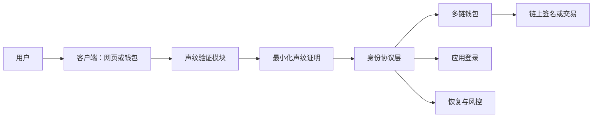

# VoiceID 开发计划施工文档

版本：v0.1  
日期：2026-06-18  
仓库：https://github.com/HiClawBot/VoiceID  
官网：https://hiclawbot.github.io/VoiceID/

## 1. 项目定位

VoiceID 是面向声纹身份、去中心化身份和多链钱包场景的协议与产品入口。当前阶段先完成品牌官网、项目资料公开、协议方向说明和后续工程施工基线，为后续钱包、网页登录、开发者接口和声纹验证模块建设提供统一标准。

项目核心表达：

- 声纹身份协议：把声音作为可验证身份入口。
- 去中心化身份：身份凭证与用户控制的钱包、密钥、恢复路径绑定。
- 多链钱包：面向资产、签名、支付、恢复和应用登录的统一身份入口。
- 透明视觉资产：所有标识应用使用透明底矢量文件，避免不同背景上的色块差异。

## 2. 当前交付范围

本阶段交付内容：

- VoiceID 官网中文版，入口为 `/`。
- VoiceID 官网英文版，入口为 `/en/`。
- 中英文页面内容各自独立，英文页面不混杂中文。
- GitHub Pages 托管配置，官网可公网访问。
- 透明底矢量品牌资产，包括图标、主标识、深色背景标识和应用图标。
- 基础白皮书下载入口。
- 本开发计划施工文档。

暂不在本阶段交付：

- 真实声纹识别模型。
- 链上合约与主网部署。
- 移动钱包客户端。
- 完整开发者工具包。
- 用户账户、后台管理和数据存储服务。

## 3. 技术施工原则

### 3.1 官网工程

- 采用静态网页结构，降低 GitHub Pages 部署复杂度。
- 页面资源以根目录静态文件为准，避免构建链依赖。
- 中英文版本使用独立页面，减少语言串混杂风险。
- 样式、脚本、矢量资产集中维护，便于后续升级。
- 页面在桌面端和移动端都需要通过横向溢出检查。

### 3.2 品牌资产

- 官网与产品示意图只使用透明底矢量标识文件。
- 浅色背景使用彩色主标识，深色背景使用适配深色场景的标识。
- 不直接嵌入带白底、深色底或截图边界的标识图片。
- 后续新增物料优先以矢量格式输出，必要时再导出位图。

### 3.3 协议产品

- 声纹验证应尽量在本地或可信边缘侧完成。
- 原始声音数据不应作为中心化资产长期保存。
- 对应用输出最小化验证结果，而不是暴露完整生物特征。
- 身份凭证、钱包地址、授权范围和恢复路径需要独立建模。
- 密码、恢复密钥或多签机制应作为声纹不可用时的回退路径。

## 4. 目标架构

模块说明：

- 客户端：承载采样、授权提示、钱包连接和登录确认。
- 声纹验证模块：完成采样、活体检测、特征比对和证明生成。
- 身份协议层：管理身份凭证、授权范围、验证状态和会话。
- 多链钱包：处理地址绑定、签名确认、资产访问和恢复流程。
- 应用接入层：向网页应用或去中心化应用输出登录与授权结果。
- 风控恢复层：处理异常登录、设备丢失、声纹不可用和恢复验证。

## 5. 里程碑计划

| 阶段 | 周期 | 目标 | 主要产出 | 验收标准 |
| --- | --- | --- | --- | --- |
| P0 品牌与官网 | 第 1 周 | 建立公开展示入口 | 官网、双语页面、矢量 VI、白皮书入口 | Pages 可访问，移动端无横向溢出，英文页无中文字符 |
| P1 协议设计 | 第 2-3 周 | 明确身份、证明和钱包绑定模型 | 协议说明、接口草案、数据结构 | 能描述登录、签名、恢复三类流程 |
| P2 原型验证 | 第 4-6 周 | 完成网页声纹登录原型 | 前端原型、模拟验证、会话流程 | 可完成一次端到端模拟登录 |
| P3 钱包接入 | 第 7-10 周 | 接入多链钱包与签名场景 | 钱包连接、签名确认、授权范围管理 | 至少支持一个测试网络钱包流程 |
| P4 安全加固 | 第 11-12 周 | 完成隐私、恢复和异常处理 | 风控规则、恢复流程、测试报告 | 关键失败路径有回退机制 |
| P5 开发者开放 | 第 13-14 周 | 输出开发者接入资料 | 接口文档、示例应用、版本说明 | 第三方可按文档完成测试接入 |

## 6. 施工任务拆解

### 6.1 官网与内容

- 维护中文版首页内容，确保品牌定位、协议能力、钱包场景和开发者方向清晰。
- 维护英文版首页内容，确保不混入中文。
- 更新白皮书下载文件与版本号。
- 为新增页面建立移动端、桌面端截图验收。
- 将品牌资产归档到 `assets/`，并保持透明底矢量格式。

### 6.2 协议层

- 定义声纹证明对象：证明标识、生成时间、验证范围、过期时间、设备上下文。
- 定义身份绑定对象：去中心化身份标识、钱包地址、链标识、恢复策略。
- 定义授权范围：登录、签名、交易确认、恢复、资料读取。
- 定义错误码：验证失败、环境异常、过期、权限不足、恢复中。
- 形成协议接口说明和最小演示数据。

### 6.3 声纹验证

- 设计采样流程：数字挑战、短语挑战、环境检测、重试机制。
- 设计活体检测：录音回放风险、噪声过高、设备异常、重复样本。
- 设计隐私策略：原始音频生命周期、特征数据存储、用户撤销。
- 确定首版验证方式：先模拟验证，再逐步接入真实模型。
- 输出验证成功、失败、降级和恢复流程。

### 6.4 钱包与身份

- 设计钱包连接流程：连接、授权、签名、解绑。
- 支持测试网络地址绑定。
- 设计多链扩展字段，避免单链耦合。
- 设计恢复路径：密码、恢复密钥、多签或设备迁移。
- 明确交易确认与登录确认的不同授权边界。

### 6.5 开发者接入

- 提供基础初始化示例。
- 提供登录、签名、恢复三个最小示例。
- 提供测试环境说明和错误码说明。
- 提供版本兼容策略。
- 后续封装开发者工具包。

## 7. 验收标准

官网验收：

- 中文官网路径 `/` 可访问。
- 英文官网路径 `/en/` 可访问。
- 英文页面可见文案不含中文字符。
- 主要页面在移动端无横向滚动。
- 站点资源无 404 请求。
- 标识文件使用透明底矢量资源。

工程验收：

- Git 仓库主分支保持可发布状态。
- 每次发布前完成本地预览。
- 关键变更有提交记录。
- Pages 构建成功后再宣布上线。

协议验收：

- 登录、签名、恢复三条主流程有文档说明。
- 接口草案能表达验证范围、钱包绑定、会话状态和错误状态。
- 隐私策略覆盖原始声音、声纹特征和证明结果。

## 8. 发布流程

1. 本地完成文件修改。
2. 使用本地静态服务器预览官网。
3. 检查中文和英文页面。
4. 检查移动端布局和横向溢出。
5. 提交 Git 变更。
6. 推送到 `main` 分支。
7. 等待 GitHub Pages 构建完成。
8. 访问线上中文和英文页面做最终确认。

## 9. 风险与控制

| 风险 | 影响 | 控制方式 |
| --- | --- | --- |
| 生物特征数据泄露 | 高 | 默认不长期保存原始音频，输出最小化证明 |
| 录音回放攻击 | 高 | 引入随机数字挑战、活体检测和设备环境检测 |
| 钱包恢复失败 | 高 | 保留密码、恢复密钥、多签或设备迁移等回退路径 |
| 语言内容混杂 | 中 | 中英文页面分离维护，发布前做字符检查 |
| 品牌资产色块不一致 | 中 | 只使用透明底矢量标识，不使用带底色截图 |
| 过早绑定具体链生态 | 中 | 数据模型保留链标识和扩展字段 |

## 10. 下一步建议

- 将白皮书升级为 VoiceID 专属版本，并与官网文案保持一致。
- 补充协议接口草案文件，明确数据结构与错误码。
- 建立声纹登录网页原型，先使用模拟验证跑通流程。
- 制作钱包连接测试页面，验证地址绑定和签名确认。
- 建立发布前检查脚本，自动检测语言混杂、断链和横向溢出。
